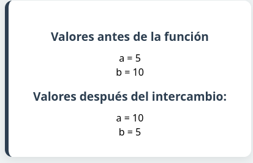
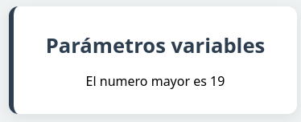

## Tema 1
## Ejercicios funciones 1
Crea una página llamada **contador.php**. Crea una función llamada `cuenta($a, $b
)` que reciba dos parámetros y vaya contando de un número al otro, separando los
números por comas. Después, pruébala en el código PHP haciendo que cuente del 10
al 20.

---

## Ejercicios funciones 2
Crea una página llamada `intercambia.php`. Añade dentro una función llamada inter-
cambia que reciba 2 parámetros numéricos por referencia, y lo que haga sea intercam-
biar sus valores. Es decir, si recibe el parámetro `$a` y el valor de `$b` , y `$b` tome el valor
de `$a`.

---

## Ejercicios funciones 3
Crea una función que devuelva el mayor de todos los números recibidos como parámetro variables:
*function mayor(): int*. Utiliza las funciones *func_get_args(), etc…*

**No puedes usar la función max()**

---

## Ejercicio funciones 4
Crea una variable de texto con una hora en ella (por ejemplo, “21:30:12”), y luego procésala
para extraer por separado la hora, el minuto y el segundo, y comprobar si es una hora válida.
Por ejemplo, la hora anterior sí debería ser válida, pero si ponemos “12:63:11” no debería serlo,
porque 63 no es un minuto válido.

---