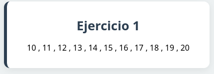

## Tema 1
## Ejercicios funciones 1
Crea una página llamada **contador.php**. Crea una función llamada `cuenta($a, $b
)` que reciba dos parámetros y vaya contando de un número al otro, separando los
números por comas. Después, pruébala en el código PHP haciendo que cuente del 10
al 20.

---

## Ejercicios funciones 2
Crea una página llamada `intercambia.php`. Añade dentro una función llamada inter-
cambia que reciba 2 parámetros numéricos por referencia, y lo que haga sea intercam-
biar sus valores. Es decir, si recibe el parámetro `$a` y el valor de `$b` , y `$b` tome el valor
de `$a`.

---
